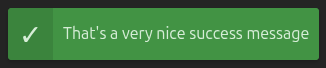
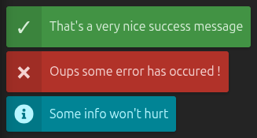
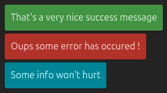
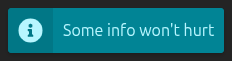

# Vue Flash 3

A very simple and lightweight notification toolbox.

## Getting started

* Install the package

```sh
npm i vue-flash3
```

* Include the component somewhere on the DOM

```vue
<style>
@use 'vue-flash3/style.css';
</style>

<template>
  <Flash />
</template>

<script setup lang="ts">
import { Flash } from 'vue-flash3'
</script>
```

* Show a message

```js
import { instance as FlashI } from 'vue-flash3'

FlashI.add('That\'s a very nice success message')
```



## Message types

There are 3 builtin types of messages: `success` (the default), `error`, `info`

```js
import { instance as FlashI } from 'vue-flash3'

FlashI.add('That\'s a very nice success message', 'success')
FlashI.add('Oups some error has occured !', 'error')
FlashI.add('Some info won\t hurt', 'info')
```



However any other types can be defined

## Customizing

### Colors

This default sass map can be overridden

```scss
$flash-colors: (
    info: #018495,
    error: #b13229,
    success: #429344,
);
```

Any type can be added and colors modified

### Icons

Icons can be disabled by simply setting the `noicon` prop

```vue
<Flash :noicon="true" />
```



The icon part can contain anything by implementing the `icons` slot

```vue
<template>
  <Flash>
    <template #icons="slotProps">
      <IconInfo v-if="slotProps.type === 'info'" />
    </template>
  </Flash>
</template>

<script setup lang="ts">
import { onMounted } from 'vue'
import { Flash, instance as FlashI } from 'vue-flash3'
import IconInfo from './icons/info-circle-solid.svg'

onMounted(() => {
    FlashI.add('Some info won\t hurt', 'info')
})
</script>
```

_We are using [vite-svg-loader](https://github.com/jpkleemans/vite-svg-loader) here with an icon from [Font-Awesome](https://fontawesome.com/)_


